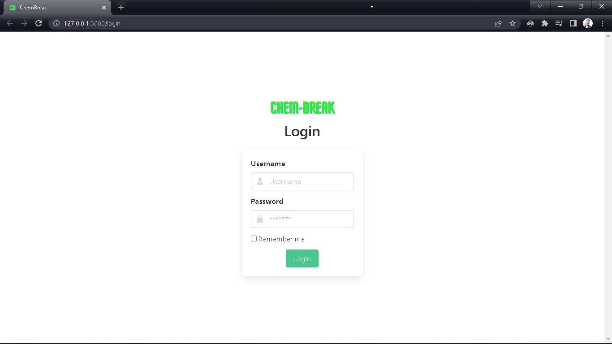
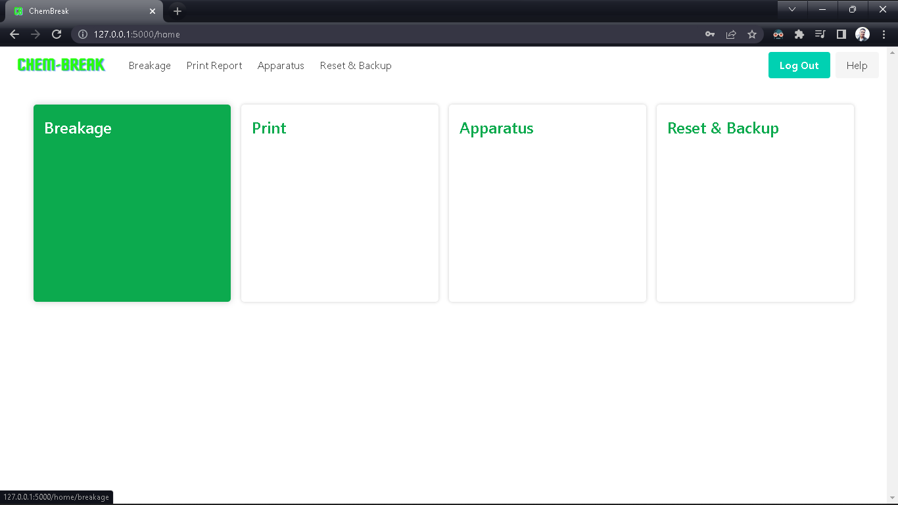
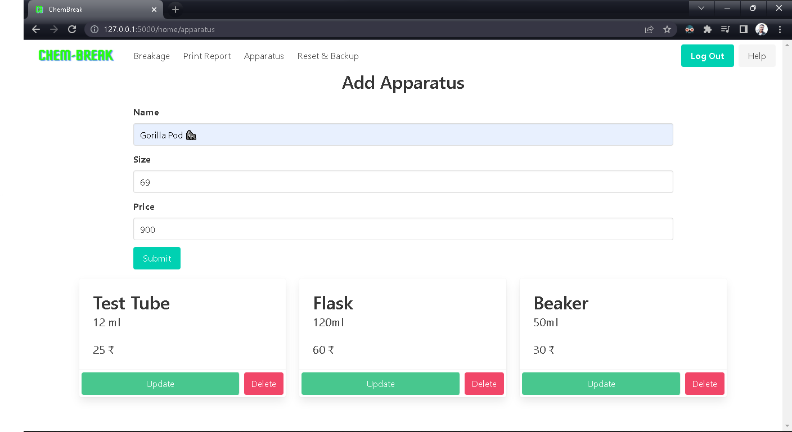
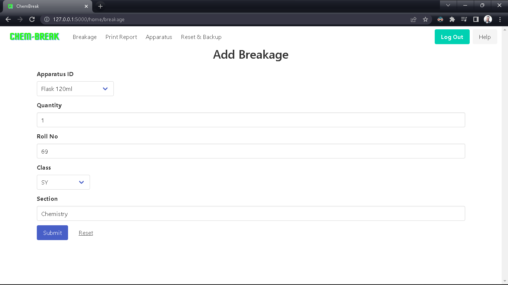
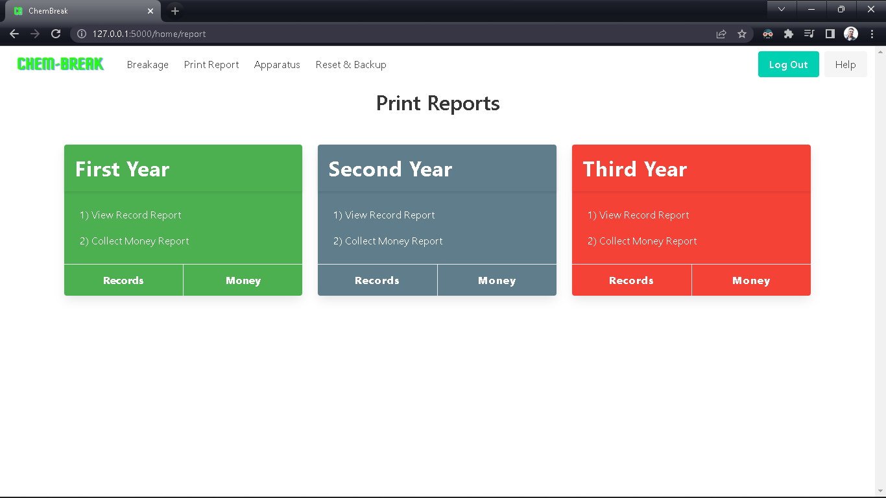
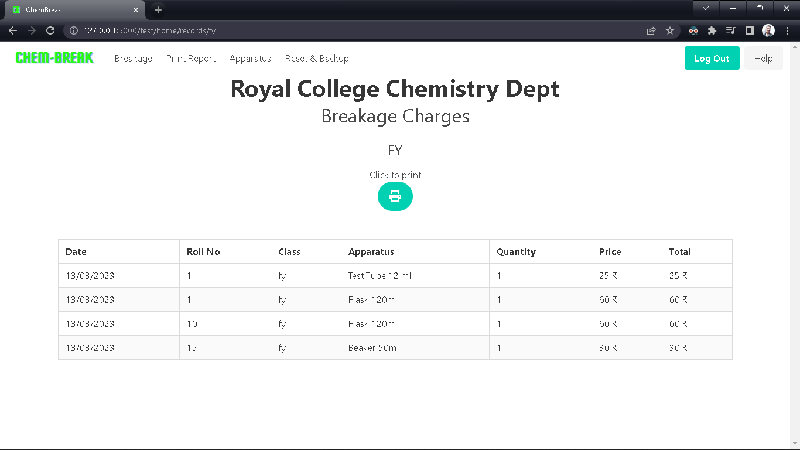
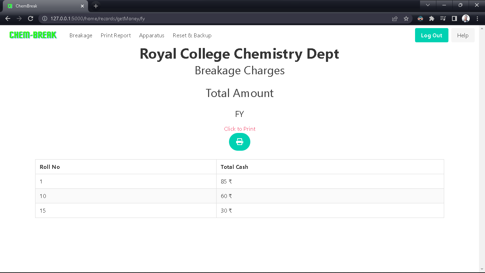
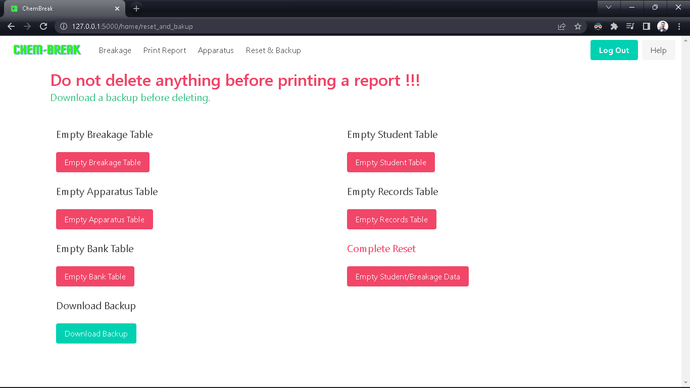

# ChemBreak Breakage App

A web application built using Flask, MySQL, and other Python Flask extensions that allow Degree College Teachers to manage breakage records in their laboratory.

## Features

- Secure login for teachers
- Add, view, and manage breakage records
- Add, edit, and delete apparatus data
- Print breakage records in printable format
- Easy to use interface

## Requirements

- Python 3.x
- pipenv
- Flask
- Flask-Login
- Flask-SQLAlchemy

## Installation

- Clone the repository and navigate to the project folder.

```
git clone https://github.com/Sayyed-Salman/Chem-Break.git Chem-Break
cd Chem-Break
```

- Create a virtual environment using pipenv.

```
pip install pipenv
```

- Install the required packages.

```
pipenv install
```

- Set the FLASK_APP environment variable.

```
export FLASK_APP=app
```

- Run the application.

```
python wsgi.py
```

The application should now be running on http://localhost:5000.

## Usage

- Navigate to http://localhost:5000 in your browser.

- Login with your credentials.

- Use the navigation bar to add, view, or manage breakage records.

- Use the print report feature to export breakage records in pdf format.

## Screenshots

- Login Page
  

- Home Page
  

- Apparatus Page
  

- Add Breakage Page
  

- Print Breakage Report Page
  

  

  

- Backup and Reset Database Page
  

## Contributing

Pull requests are welcome. For major changes, please open an issue first to discuss what you would like to change.

Please make sure to update tests as appropriate.

## License

MIT
